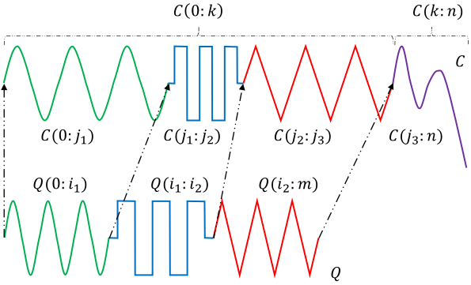
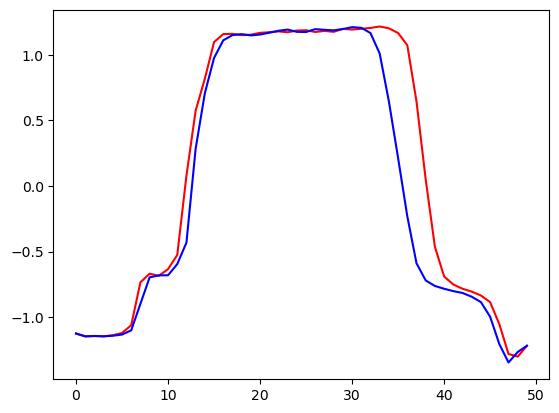

# Scaling with Multiple Scaling Factors and Dynamic Time Warping in Time Series Searching
<!-- https://stackoverflow.com/questions/39777166/display-pdf-image-in-markdown -->
<!-- for d in *.pdf ; do inkscape --without-gui --file=$d --export-plain-svg=${d%.*}.svg ; done -->

- This figure shows the necessity of our novel distance measure PSDTW.


# Notifications
Dates on [AoE](https://www.timeanddate.com/time/zones/aoe) Time Zone
- 2025-06-07 Slides will be uploaded here later.
- 2025-06-06 Submitted to [ICDM 2025](https://www3.cs.stonybrook.edu/~icdm2025/index.html)

# Install
```
conda create -n ksfdtw python=3.12
conda activate ksfdtw
conda install -c conda-forge dtaidistance
pip install pandas
conda install -c conda-forge tslearn
pip install tqdm
pip install pyts
# Others common time series libraries that are not used in the project.
conda install -c conda-forge sktime  
conda install -c conda-forge aeon
```

# Project Structure
<!-- https://stackoverflow.com/questions/23989232/is-there-a-way-to-represent-a-directory-tree-in-a-github-readme-md -->
- Important folders and files in this repository are listed as belows: 
```bash
├── code
│   ├── data-exploration.ipynb # Explore GunPoint dataset 
│   ├── ksfdtw.py # Custom libraries
│   ├── main.ipynb # Explore manipulation of time series in Python
│   ├── querying.ipynb # Experiment
│   └── testing # The scripts under this folder is for development purpose and only for book-keeping purpose.
├── data # Processed dataset after processing in "data-exploration.ipynb "
│   └── gunpoint_preprocessed.npz
├── README.md # Here
└── results # Results generated from "querying.ipynb"
```

# Corresponding Paper
- Information of the relevant paper will be uploaded here after paper acceptance.

# Figures in the Paper
- Figures 1, 3, 4, 5, 6 can be found in `../main.ipynb`.
- Figures 7 (raw figures), 8 can be found in `../data-exploration.ipynb`.
